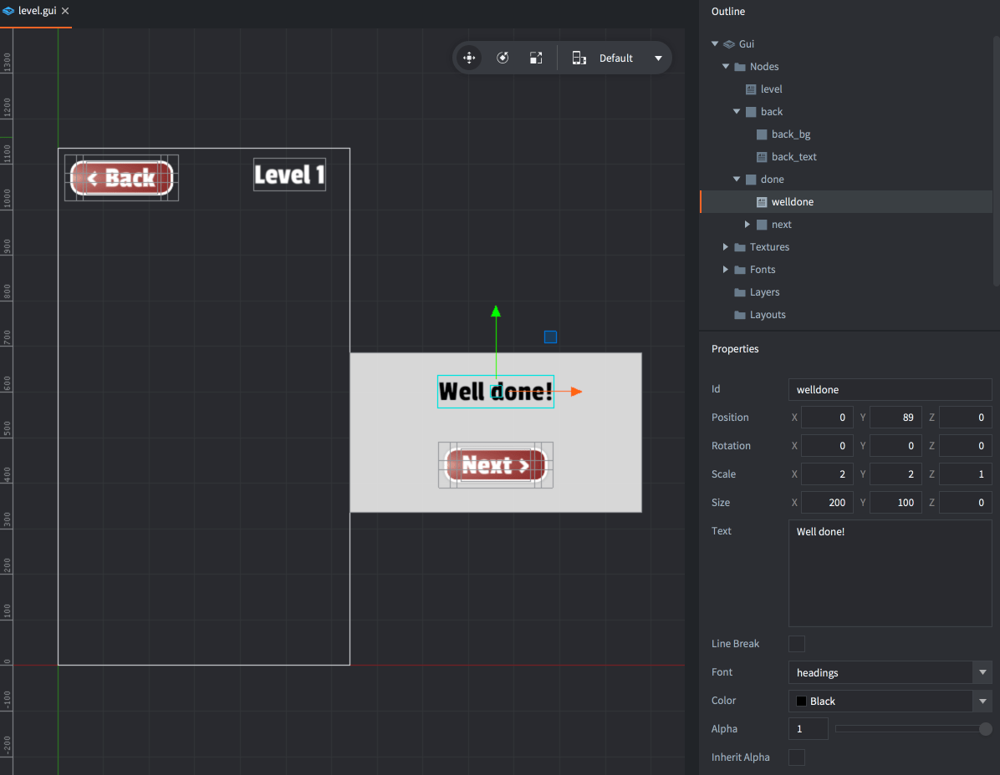
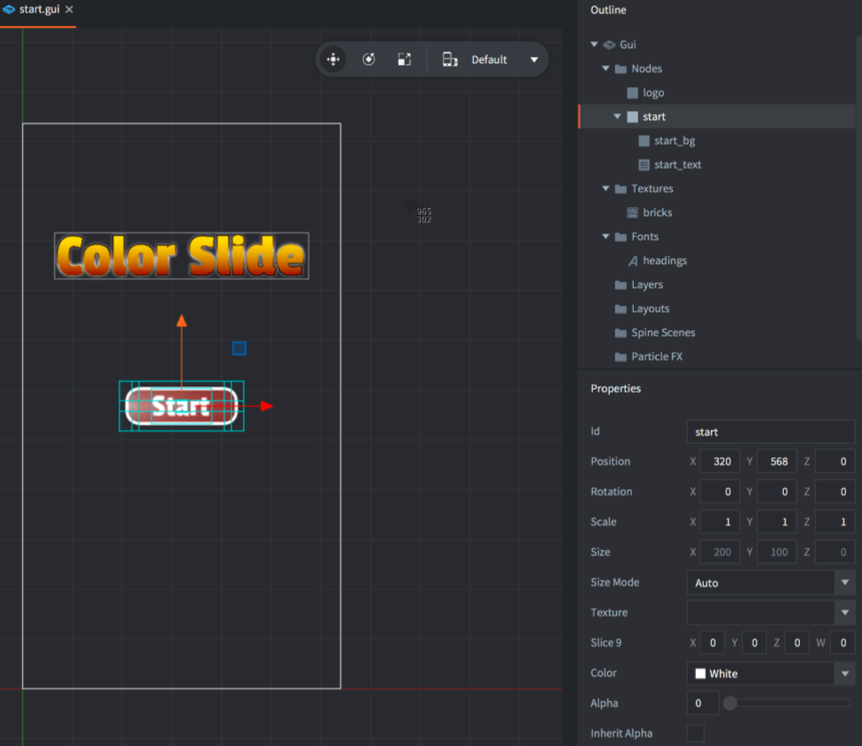
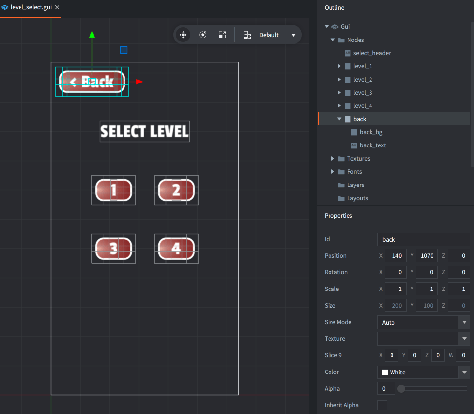

# Color slide tutorial

Welcome to the Colorslide game tutorial where you will learn how to build a simple GUI flow for a multi level game. This tutorial assumes that you know your way around the editor. Please check out one of our beginner tutorials if you are new to Defold and want to learn the basics.

The starting point for this tutorial is this project that contains the following:

- A simple but fully playable game where the player needs to slide the bricks to the correct position.
- 4 levels included of various difficulty. Each level is built in its own collection.
- Assets so you can build any number of levels, using the built in tile editor.
- The bricks have some personality coded into them.
- When the player completes a level, the bricks jump happily and the player cannot slide them anymore.

What you will do in this tutorial is the following:

- Add a start screen.
- Add a level selection screen allowing the player to select and play any of the 4 levels.
- Add navigation buttons between the screens.

Start by [trying the game](defold://build), then open ["main.collection"](defold://open?path=/main/main.collection) to see how the game is set up.


The whole game is contained in the subcollection inside "main.collection". Currently, "level" references the file "/main/level_2/level_2.collection". Inside the subcollection are two game objects:

1. One game object (with id "board") holds the tilemap. Notice that there are two layers on the tilemap, one is the actual playfield ("board") and one contains the intitial setup for the bricks ("setup"). The game clears "setup" on start and replaces the brick tiles with separate game objects that can be animated freely.

2. One game object (with id "level") contains the game logic script and a factory used to spawn bricks on game start. This game object is stored in a separate file called "/main/level.go" so it can be referenced in each separate level.

Now mark "level" in "main.collection" and change its reference in the *Path* property to "/main/level_3/level_3.collection". Build and run the game again (<kbd>Project ▸ Build</kbd>) and try playing that level.

## Loading collections via proxy

What you need is a way to select what collection to load and play during runtime. Defold contains two mechanisms for loading collections dynamically:

1. Collection factories. This is a good choice for spawning hierarchies of objects into a running game. Any spawned object will be part of the startup main collection world and live until the game shuts down, unless you explicitly delete the objects yourself.

2. Collection proxies. This is a good choice when you want to load larger chunks of a game dynamically, for instance a game level. With a proxy you create a new "world" based on the collection. Any object that is spawned from the collection content will be part of the created world and be destroyed when the collection is unloaded from the proxy. The new world comes with an overhead so you should not use proxies to load many collections simultaneously.

For this game, proxies will be the best choice.

Open "main.collection" and remove the "level" collection reference. Instead, add a new game object and give it id "loader".

Add a collection proxy component to the game object and set its *Collection* property to "/main/level_1/level_1.collection".

Add a new script file called "loader.script" and add it as a script component to the "loader" game object.


Open "loader.script" and change its content to the following:

```lua
function init(self)
    msg.post("#proxy_level_1", "load")                      -- [1]
end

function on_message(self, message_id, message, sender)
    if message_id == hash("proxy_loaded") then              -- [2]
        msg.post(sender, "init")
        msg.post(sender, "enable")
    end
end
```
1. Send a message to the proxy component telling it to load its collection.
2. When the proxy component is done loading, it sends a "proxy_loaded" message back, then it is fine to init and enable the collection. These messages can be sent to "sender" which is the proxy component.

Now try to run the game.

Unfortunately there is an instant error in the console:

```
ERROR:GAMEOBJECT: The collection 'default' could not be created since there is 
already a socket with the same name.
WARNING:RESOURCE: Unable to create resource: /main/level_1/level_1.collectionc
ERROR:GAMESYS: The collection /main/level_1/level_1.collectionc could not be loaded.
```

The error occurs because the proxy tries to create a new world (socket) named "default". One such world already exists - the one created from "main.collection" att engine boot. The socket name is set in the properties of the collection root so it's easy to fix:


Open the file "/main/level_1/level_1.collection", mark the root of the collection and set the *Id* property to "level_1". Save the file.

Try try running the game again.

The level should show up, but if you try to click on the board and move a tile, nothing happens. Why?

The problem is that the script that deals with input is now inside the proxied world. The input system works so that it sends input to game objects in the bootstrap collection that listens to input. If one of these listeners contains a proxy, input is directed to any listeners in the collection behind the proxy. So in order to get input into the proxy collection, simply add a line to the loader script's `init()` function:

```
function init(self)
    msg.post("#proxy_level_1", "load")
    msg.post(".", "acquire_input_focus")                -- [1]
end
```
1. Since this game object holds the proxy for the collection that needs input, this game object needs to acquire input focus too.

Run the game again. Now everything should work as expected.

The game contains four levels so you need to add proxies for the remaining three levels. That is a matter of just repeating what you just did. Don't forget to change the *Id* property to a unique name for each level collection.


Test each level by altering the proxy component you send the "load" message (`msg.post("#proxy_level_2", "load")` for instance) before moving on.

## The level selection screen

Now you have the setup required to load any level and it is time to construct an interface to the level loading.

Create a new GUI file and call it "level_select.gui".

Add "headings" to the *Font* section and the "bricks" atlas to the *Textures* section of the GUI.

Construct an interface with 4 buttons, one for each level. It's practical to create one root node for each button and put the graphics and text as children to each root node:


Create a new GUI script file and call it "level_select.gui_script".

Open "level_select.gui" and set the *Script* property on the root node to the new script.

Open "level_select.gui_script" and change the script to the following:

```lua
function init(self)
    msg.post(".", "acquire_input_focus")
    msg.post("#level_select", "show_level_select")                      -- [1]
    self.active = false
end

function on_message(self, message_id, message, sender)
    if message_id == hash("show_level_select") then                     -- [2]
        msg.post("#level_select", "enable")
        self.active = true
    elseif message_id == hash("hide_level_select") then                 -- [3]
        msg.post("#level_select", "disable")
        self.active = false
    end
end

function on_input(self, action_id, action)
    if action_id == hash("touch") and action.pressed and self.active then
        for n = 1,4 do                                                  -- [4]
            local node = gui.get_node("level_" .. n)
            if gui.pick_node(node, action.x, action.y) then             -- [5]
                msg.post("/loader#loader", "load_level", { level = n }) -- [6]
                msg.post("#level_select", "hide_level_select")          -- [7]
            end
        end
    end
end
```
1. Set up the GUI.
2. Showing and hiding the gui is triggered via messaging so it can be done from other scripts.
3. React to the pressing of touch input (as set up in the input bindings).
4. The button nodes are named "level_1" to "level_4" so you can loop this.
5. Check if the touch action happens within the boundaries of level_n, i.e. the button is pressed.
6. Send a message to the loader script to load level n. Notice that a "load" message is not sent directly to the proxy from here since this script does not deal with the rest of the proxy loading logic (reaction to "proxy_loaded).
7. Hide this GUI.

The loader script needs a bit of new code to react to the "load_level" message, and the proxy loading on init should be removed. Open "loader.script" and change the `init()` and `on_message()` functions:

```lua
function init(self)
    msg.post(".", "acquire_input_focus")
end

function on_message(self, message_id, message, sender)
    if message_id == hash("load_level") then
        local proxy = "#proxy_level_" .. message.level                  -- [1]
        msg.post(proxy, "load")
    elseif message_id == hash("proxy_loaded") then
        msg.post(sender, "init")
        msg.post(sender, "enable")
    end
end
```
1. Construct which proxy to load based on message data.

Open "main.collection" and add a new game object with id "guis".

Add "level_select.gui" as a GUI component to the new "guis" game object.

Run the game and test the flow. You should be able to click any of the level buttons and the corresponding level will load and be playable.

## In game GUI

You can now select a level and play it but there is no way to go back. The next step is to add an in game GUI that allows you to navigate back to the level selection screen. It should also congratulate the player when the level is completed and allow moving directly to the next level.

Create a new GUI file and call it "level.gui".

Add "headings" to the *Font* section and the "bricks" atlas to the *Textures* section of the GUI.

Build one back-button at the top and one level number indicator at the top.

Build a level complete message with a well done message and a next-button. Child these to a panel (a colored box node) and place it outside of the view so they can be slid into view when the level is completed:



Create a new GUI script file and call it "level.gui_script".

Open "level.gui" and set the *Script* property on the root node to the new script.

Open "level.gui_script" and change the script to the following:

```lua
function on_message(self, message_id, message, sender)
    if message_id == hash("level_completed") then                       -- [1]
        local done = gui.get_node("done")
        gui.animate(done, "position.x", 320, gui.EASING_OUTSINE, 1, 1.5)
    end
end

function on_input(self, action_id, action)                              -- [2]
    if action_id == hash("touch") and action.pressed then
        local back = gui.get_node("back")
        if gui.pick_node(back, action.x, action.y) then
            msg.post("default:/guis#level_select", "show_level_select")  -- [3]
            msg.post("default:/loader#loader", "unload_level")
        end

        local next = gui.get_node("next")
        if gui.pick_node(next, action.x, action.y) then
            msg.post("default:/loader#loader", "next_level")            -- [4]
        end
    end
end
```
1. If message "level_complete" is received, slide the "done" panel with the next button into view.
2. We are going to put this GUI on the "level" game object which already acquires input focus in "level.script" so this script should not do that.
3. If the player presses "back", tell the level selector to show itself and the loader to unload the level.
4. If the player presses "next", tell the loader to load the next level.

Open "loader.script" and change it to the following:

```lua
function init(self)
    msg.post(".", "acquire_input_focus")
    self.current_level = 0                                              -- [1]
end

function on_message(self, message_id, message, sender)
    if message_id == hash("load_level") then
        self.current_level = message.level
        local proxy = "#proxy_level_" .. self.current_level
        msg.post(proxy, "load")
    elseif message_id == hash("next_level") then                        -- [2]
        msg.post("#", "unload_level")
        msg.post("#", "load_level", { level = self.current_level + 1 })
    elseif message_id == hash("unload_level") then                      -- [3]
        local proxy = "#proxy_level_" .. self.current_level
        msg.post(proxy, "disable")
        msg.post(proxy, "final")
        msg.post(proxy, "unload")
    elseif message_id == hash("proxy_loaded") then
        msg.post(sender, "init")
        msg.post(sender, "enable")
    end
end
```
1. Keep track of the currently loaded level so it can be unloaded and it is possible to advance to the next one.
2. Load next level. Note that there is no check if there actually exists a next level.
3. Unload the currently loaded level.

Open "level.script" and add a message to the level gui when the game is finished at the end of `on_input()`:

```lua
                ...
                -- check if the board is solved
                if all_correct(self.bricks) then
                    msg.post("#gui", "level_completed")                 -- [1]
                    self.completed = true
                end
            end
            ...
```
1. Tell the GUI to show the level completed panel.

Finally, open "level.go" and add "level.gui" as a GUI component to the game object.

Run the game. You should be able to select a game, go back to the level selection screen (with the "back" button) and also start the next level when one is finished.

## Start screen

The final piece of the puzzle is the start screen. At this moment, it should be very straightforward.

Create a new GUI file and call it "start.gui".

Add "headings" to the *Font* section and the "bricks" atlas to the *Textures* section of the GUI.

Build the front screen. Add logo and a "start" button:



Create a new GUI script file and call it "start.gui_script".

Open "start.gui" and set the *Script* property on the root node to the new script.

Open "start.gui_script" and change the script to the following:

```lua
function init(self)
    msg.post("#start", "show_start")                                         -- [1]
    self.active = false 
end

function on_message(self, message_id, message, sender)
    if message_id == hash("show_start") then                            -- [2]
        msg.post("#start", "enable")
        self.active = true
    elseif message_id == hash("hide_start") then
        msg.post("#start", "disable")
        self.active = false
    end
end

function on_input(self, action_id, action)
    if action_id == hash("touch") and action.pressed and self.active then
        local start = gui.get_node("start")
        if gui.pick_node(start, action.x, action.y) then                -- [3]
            msg.post("#start", "hide_start")
            msg.post("#level_select", "show_level_select")
        end
    end
end
```
1. Start by showing this screen.
2. Messages to show and hide this screen.
3. If the player presses the "start" button, hide this screen and show the level selection gui.

Open "main.collection" and add "start.gui" as a GUI component to the "guis" game object.

Now open "level_select.gui" and add a "back" button. You can copy and paste the one you made in "level.gui" if you want.



Open "level_select.gui_script" and add the code for returning to the start screen:

```lua

function on_input(self, action_id, action)
    if action_id == hash("touch") and action.pressed and self.active then
        for n = 1,4 do
            local node = gui.get_node("level_" .. n)
            if gui.pick_node(node, action.x, action.y) then
                msg.post("/loader#loader", "load_level", { level = n })
                msg.post("#level_select", "hide_level_select")
            end
        end

        local back = gui.get_node("back")                               -- [1]
        if gui.pick_node(back, action.x, action.y) then
            msg.post("#level_select", "hide_level_select")
            msg.post("#start", "show_start")
        end
    end
end
```
1. Check if the player clicks "back". If so, hide this GUI and show the start screen.

And that's it. You are done! Run the game and verify that everything works as expected.

## What next?

This GUI implementation is very simple. Each screen deals with its own state and contains the code to take you to other screens. Messages are sent between the GUI components to handle this. If your game does not feature advanced GUI flows this method is sufficient and clear enough. However, for more advanced GUIs you might want to use some sort of screen manager. Either roll your own or include one as a library. Check out https://www.defold.com/community/assets/ for community written libraries.

If you want to continue experimenting with this tutorial project, here are some exercise suggestions:

1. Add navigation back to the main menu from the level selection screen.
2. Implement locking/unlocking of levels: only allow the player to select and play unlocked levels and unlock them one by one as the game progresses.
3. Take care of the case where the player completes the last level and there is no "next" one.
4. Create so many levels that they won't fit on one level selection screen and solve that problem.

Check out [the documentation pages](https://defold.com/learn) for more examples, tutorials, manuals and API docs.

If you run into trouble, help is available in [our forum](https://forum.defold.com).

Happy Defolding!

---