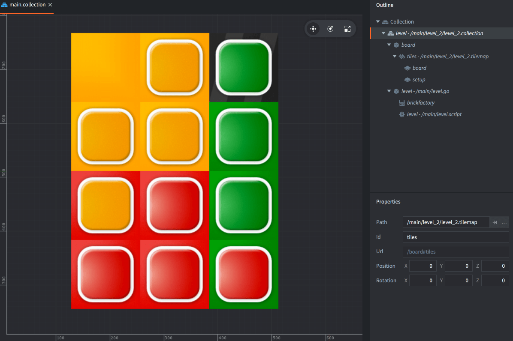
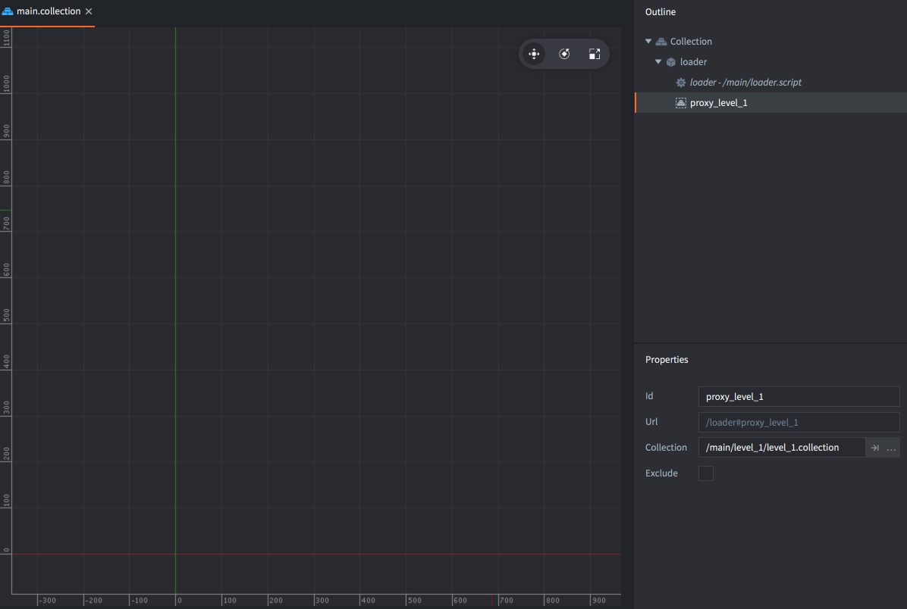

Welcome to the Colorslide game tutorial where you will learn how to build a GUI flow for a multi level game. This tutorial assumes that you know your way around the editor. Please check out one of our beginner tutorials if you are new to Defold and want to learn the basics.

The starting point for this tutorial is this project that contains the following:

- A simple but fully playable game where the player needs to slide the bricks to the correct position.
- 4 levels included of various difficulty. Each level is built in its own collection.
- Assets so you can build any number of levels, using the built in tile editor.
- The bricks have some personality coded into them.
- When the player completes a level, the bricks jump happily and the player cannot slide them anymore.

What you will do in this tutorial is the following:

- Add a start screen.
- Add a level selection screen allowing the player to select and play any of the 4 levels.
- Add navigation buttons between the screens.

Start by [trying the game](defold://build), then open ["main.collection"](defold://open?path=/main/main.collection) to see how the game is set up.



The whole game is contained in the subcollection inside "main.collection". Currently, "level" references the file "/main/level_2/level_2.collection". Inside the subcollection are two game objects:

1. One game object (with id "board") holds the tilemap. Notice that there are two layers on the tilemap, one is the actual playfield ("board") and one contains the intitial setup for the bricks ("setup"). The game clears "setup" on start and replaces the brick tiles with separate game objects that can be animated freely.

2. One game object (with id "level") contains the game logic script and a factory used to spawn bricks on game start. This game object is stored in a separate file called "/main/level.go" so it can be referenced in each separate level.

Now mark "level" in "main.collection" and change its reference in the *Path* property to "/main/level_3/level_3.collection". Build and run the game again (<kbd>Project ▸ Build</kbd>) and try playing that level.

What you need now is a way to select what collection to load and play during runtime. Defold contains two mechanisms for loading collections dynamically:

1. Collection factories. This is a good choice for spawning hierarchies of objects into a running game. Any spawned object will be part of the startup main collection world and live until the game shuts down, unless you explicitly delete the objects yourself.

2. Collection proxies. This is a good choice when you want to load larger chunks of a game dynamically, for instance a game level. With a proxy you create a new "world" based on the collection. Any object that is spawned from the collection content will be part of the created world and be destroyed when the collection is unloaded from the proxy. The new world comes with an overhead so you should not use proxies to load many collections simultaneously.

For this game, proxies will be the best choice.

## Create a collection proxy

Open "main.collection" and remove the "level" collection reference. Instead, add a new game object and give it id "loader".

Add a collection proxy component to the game object and set its *Collection* property to "/main/level_1/level_1.collection".

Add a new script file called "loader.script" and add it as a script component to the "loader" game object.



Open "loader.script" and change its content to the following:

```lua
function init(self)
    msg.post("#proxy_level_1", "load")                      -- [1]
end

function on_message(self, message_id, message, sender)
    if message_id == hash("proxy_loaded") then              -- [2]
        msg.post(sender, "init")
        msg.post(sender, "enable")
    end
end
```
1. Send a message to the proxy component telling it to load its collection.
2. When the proxy component is done loading, it sends a "proxy_loaded" message back, then it is fine to init and enable the collection. These messages can be sent to "sender" which is the proxy component.

Now try to run the game. There is an instant error in the console, but don't pull your hair out just yet:

```
ERROR:GAMEOBJECT: The collection 'default' could not be created since there is already a socket with the same name.
WARNING:RESOURCE: Unable to create resource: /main/level_1/level_1.collectionc
ERROR:GAMESYS: The collection /main/level_1/level_1.collectionc could not be loaded.
```

The error occurs because the proxy tries to create a new world (socket) named "default". One such world already exists - the one created from "main.collection" att engine boot. The socket name is set in the properties of the collection root so it's easy to fix:


Check out [the documentation pages](https://defold.com/learn) for examples, tutorials, manuals and API docs.

If you run into trouble, help is available in [our forum](https://forum.defold.com).

Happy Defolding!

---